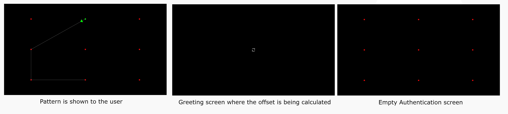

# Gaze Authentication System for Thesis Experiment



This is a Python-based authentication system developed as part of an experiment for a thesis. 
The system utilizes gaze data for user authentication and provides an interface for both touch-based and gaze-based authentication methods.
It includes components for handling gaze data, fixation detection, password validation, and user authentication.

## Table of Contents

- [Introduction](#introduction)
- [Features](#features)
- [Installation](#installation)
- [Usage](#usage)
- [Components](#components)
- [Configuration](#configuration)


## Introduction

The Gaze Authentication System is designed to serve as an experiment for a thesis, exploring the feasibility and effectiveness of gaze-based authentication.
It offers an alternative authentication method using gaze data and fixation points.
The system is built using the Kivy framework for the graphical user interface and Tobii Research SDK for gaze data collection and processing.

## Features

- Support for both touch-based and gaze-based authentication methods.
- Fixation detection for identifying user interactions.
- Password validation using gaze data and fixation points.
- Graphical Interface for touch- and gaze-based authentication.
- Configurable settings for various aspects of the authentication process.


## Installation

1. Clone this repository to your local machine.
2. Install the required dependencies using `pip`:

   ```bash
   pip install -r requirements.txt


## Usage

1. Run the authentication system using the provided `main.py` script:

   ```bash
   python main.py
   ```

2. The authentication system will launch with the specified modality (Gaze or Touch).


## Components

The codebase consists of the following main components:

- `main.py`: Entry point for running the authentication system.
- `frontend.py`: Manages the user interface and interaction modalities.
- `gaze_frontend.py`: Implements the gaze-based authentication frontend.
- `touch_frontend.py`: Implements the touch-based authentication frontend.
- `authenticator.py`: Main authentication module which acts as a mediator between other modules.
- `validator.py`: Validates user input for password entry.
- `gaze_handler.py`: Collects and processes gaze data.
- `fixation_handler.py`: Handles fixation detection, calculates offsets, and calculations.


## Configuration

The configuration for the authentication system can be found in the `config.py` file.
You can customize various settings, such as password lists, training mode, and display preferences.
This configuration is used for the experiment design.

### Participant Information

- `participant`: Name of the participant.
- `training`: Boolean indicating if the system is in training mode.
- `modality`: Current authentication modality (Gaze or Touch).

### Screen and Display Options

- `WIDTH`, `HEIGHT`: Screen dimensions.
- `AOI_RADIUS`: Area of Interest (AOI) radius for gaze-based interactions.
- `PASSWORD_SHOW_TIME`: Time to display the password.
- `GREETING_TIME`: Duration for the greeting screen.

### Fixations and Saccade Options

- `duration_threshold`: Threshold for fixation duration.


### Offset and Greeting Options

- `eyes_recognition_duration`: Duration for eyes recognition.
- `greetings_duration`: Duration of greetings display.
- `offset_trigger_radius`: Radius for offset triggering.

### Password Options

- `strict_password`: Boolean for strict password validation.
- `PASSWORD_LIST`: List of password combinations for authentication.
- `TRAININGS_PASSWORD_LIST`: List of password combinations for training.
- `set_size`: Size of the password set for authentication.

### File Paths

- `root`: Root directory for records.
- `acc_precision_root`: Directory for accuracy and precision records.
- `video_root`: Directory for video records.
- `avatar`: Path to the avatar image.
- `ARROW_PATH`: Path for arrow icons.
- `GREETING_ARROW_PATH`: Path for the greeting arrow icon.

### Debugging and Drawing

- `debug`: Boolean for enabling debugging mode.
- `draw`: Boolean for enabling drawing mode.

---